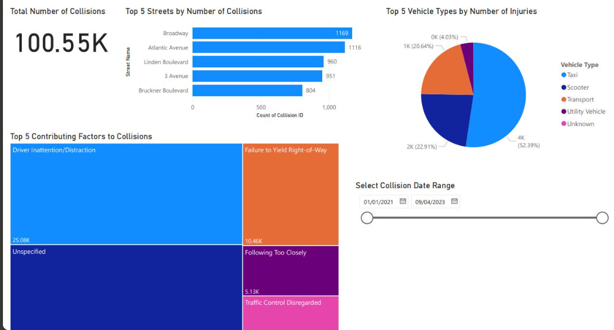

# NYC Motor Vehicle Collision Trends Dashboard (2021-2023)

A Power BI dashboard analysing motor vehicle collisions across New York City from January 2021 to September 2023, built to support public safety analysts and decision-makers in identifying key trends and high-risk areas.

Note: The original .pbix file is no longer available. This repo showcases the dashboard through a screenshot, along with a summary of the approach and key insights.

---

## Project Objective

To analyse NYC motor vehicle collision data, identifying the streets, vehicle types, and contributing factors most associated with collisions, in order to support traffic safety improvements.

---

## Data Source

NYC motor vehicle collision dataset, January 2021 to September 2023 (source not retained).

---

## Tools & Skills Used

| Stage | Tools |
|---|---|
| Data cleaning & transformation | Power Query |
| Data modelling | Power BI |
| Calculated metrics | DAX (KPI cards, treemap breakdowns) |
| Dashboard development | Power BI Desktop |
| Interactivity | Date range slicer |

---

## Dashboard Overview

- Total Number of Collisions: 100.55K
- - Top 5 Streets by Number of Collisions: Broadway (1,169), Atlantic Avenue (1,116), Linden Boulevard (960), 3 Avenue (951), Bruckner Boulevard (804)
  - - Top 5 Vehicle Types by Number of Injuries: Taxi (52.39%), Transport (22.91%), Scooter (20.64%), Utility Vehicle (4.03%), Unknown (small share)
    - - Top 5 Contributing Factors to Collisions: Driver Inattention or Distraction (25.08K), Failure to Yield Right-of-Way (10.46K), Unspecified, Following Too Closely (5.13K), Traffic Control Disregarded
      - - Interactive Filter: collision date range slicer (01/01/2021 to 09/04/2023)
       
        - ---

        ## Key Insights

        - Driver inattention or distraction is by far the leading contributing factor, at 25.08K incidents, more than double the second most common cause, failure to yield right-of-way, pointing to distraction-related enforcement and awareness as the highest-impact area for intervention
        - - Taxis account for over half of injuries by vehicle type (52.39%), a disproportionate share that likely reflects both taxi density in the city and the amount of time these vehicles spend on the road
          - - Broadway and Atlantic Avenue top the list of highest-collision streets, both major, high-traffic corridors, suggesting street design and traffic volume are key risk factors independent of driver behaviour
           
            - ---

            ## Repo Contents

            README.md and nyc_collisions.png

            ---

            ## About

            Independent Power BI project, part of a self-directed portfolio built to strengthen data analytics and dashboard design skills. Completed August 2025.
            
